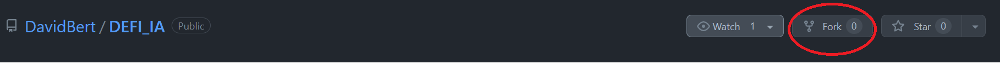
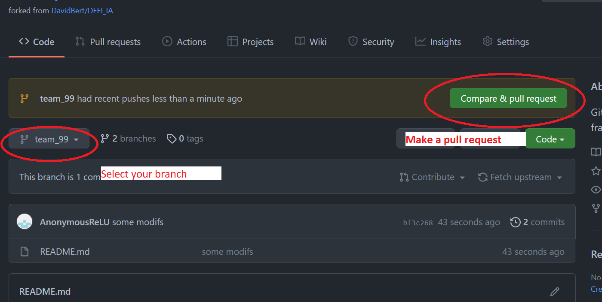
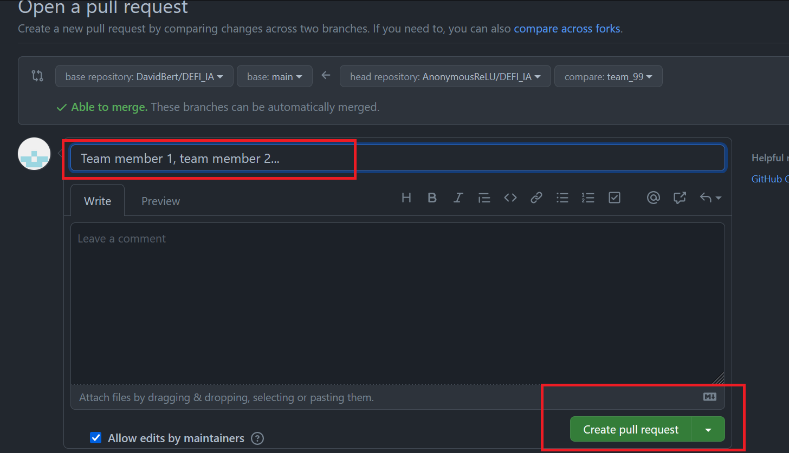

# DEFI_IA
Git repository for the evaluation of the AI frameworks DEFI IA project 2021-2022

## How to submit your work
You must submit your code as a pull request to this repo.

First make a fork of this repo:

Use git to clone your code in a local repository.
Create a new branch named with your team number (according to this [file](https://docs.google.com/spreadsheets/d/1UHll3nVPrjPy9EfPd-dGmGaxQGMsWdlEL-FCNmTmgn8/edit#gid=907028874))
Add and comit your code to this branch and push the branch to your forked repository.  
Then go to your fork on github, selct your branch and create a pull request.
.
Add your team members in the description and create your pull request.  

Send me an email at bertoin@insa-toulouse.fr to warn me about your pull request.
I'll get back to you so you can be sure that everything is ok.

## What should it contain?

Your work must contain:

* the pdf file for your report.
* a file ```requirement.txt``` containing all the required librairies to run your code.  
Be sure that all the needed librairies are present in this file.
Also verify that no unused library is present in this file.

* a python script `train.py` that will train your model and outputs your final trained model as a pickle file and your predictions on the test data in a csv format.
Your script must take as argument:
    *  `--data_path`: the path to a folder containing all the data files.
    Before executing your script, I will create a folder containing all the unziped files obtained when calling the following command: 
    ```console
    kaggle competitions download -c defi-ia-2022
    ```
    *   `--output_folder`: the path to an input folder where to output your model and predictions.
    * a file README.md describing a little your code (for exemple which file/class does the data preprocessing, which one defines your model ...)

I will call your script with the following command:
```console
python train.py --data_path Data --output_folder Results
``` 
Before running this command I will create a virtual env and install the libraries in the `requirements.txt` file.
I expect your code to run without any bug and to produce the desired outputs.  

Please check that it is the case: create a new virtual environment, clone your repo and run the command:

```console
python train.py --data_path PATH_TO_YOUR_DATA_FOLDER --output_folder PATH_TO_OUTPUT_FOLDER
``` 
If the command does not work for me you won't have the points associated to the coding part of the project.

You will be evaluated on the clarity of your code, I do not expect a single file doing all the work!

